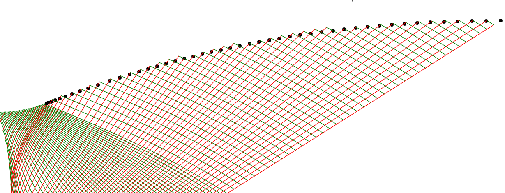
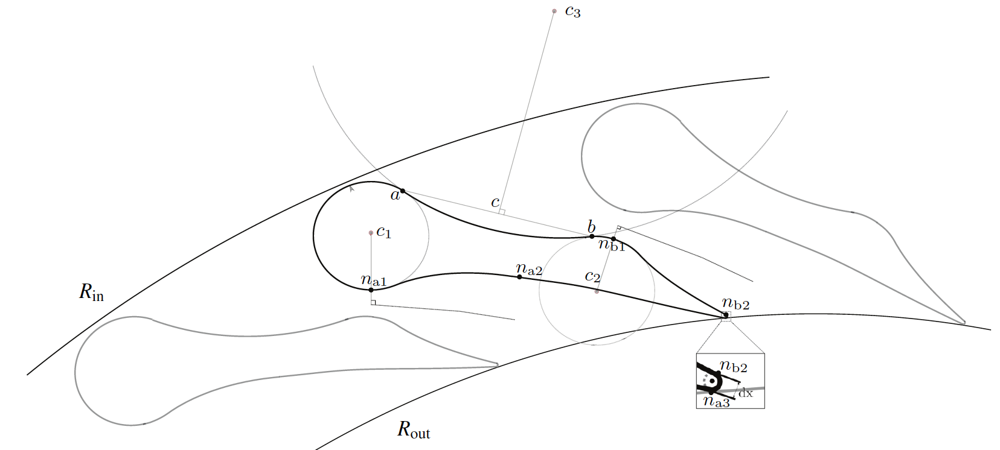
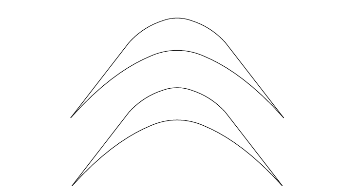

# SUPERSONIC CASCADE DESIGN TOOL
***


    


***

## Description
This python tool is a design tool for supersonic turbines operating with non-ideal fluids. The foundation of this method is Method of Charateristics which is utilized to design shock-free channels in past.  

###1. Method of Characteristics (MoC): 
The Gas-Dynamic equations becomes hyperbolic which the flow is supersonic. One of the way to obtaine restuls of such equations is Method of Charateristics. This solution of the domain is obtained by progressing in the spatial direction in samll steps.  

###2. Supersonic Stator (SSS):
Supersonic stator is generated as a post processing the result of the MoC. The nozzle geomtry is obtained by re-orienting the suction side of the nozzle with the pitch and completeing the geometry using NURBS or straight lines. In the case of radial stator, the planar nozzle from MoC is transformed into a curved nozzle (maintaining the flow angle) using a geometrical transformation [1].  

###3. Supersonic Rotor (SSR):  
Supersonic Rotor uses the concept of Method of Waves which is similar to Method of charateritics and has been well documented in Zucrow & Hoffman Vol. 1 & 2. The method relates the Mach number with the change in flow angle. Using this relation, curvature of the blade can be defined.  
 

***

# Installation

###pip  
Pip is a python package installation tool. It can be used to install and manage all other packages. To learn more about pip click on the link below.  
   
Install pip in Linux using the command below for MacOS install brew.
```
sudo apt-get install python-setuptools python-dev build-essential
```
  
###NURBS Library
To create the converging section of the stator NURBS curve is used. This tool uses a NURBS library from a developed on github. Link to which page is available below.   
[](https://github.com/orbingol/NURBS-Python)
```
git clone https://github.com/orbingol/NURBS-Python.git
```

###CoolProp Library
The thermodynamic properties can be calculated using CoolProp in MoC. Apart from that PERFECT GAS EQS. is also implemented.  
[](http://www.coolprop.org/)  
  
```
sudo pip3 install CoolProp
```

###Numpy  
[](https://www.numpy.org/)
  
```
sudo pip3 install numpy
```

###MatPlotLib
All plotting routines are done using Matplotlib.    
[](https://matplotlib.org/)
  
```
sudo pip3 install matplotlip
```

###SciPy
  
[](https://www.scipy.org/)
  
```
sudo pip3 install scipy
```
# Run
To run the code from any terminal, run RunMe.sh in the HOME folder. Add the instructions in your ~/.bashrc file. This would load SuperSonicTurbune.py in your environment.
```
RunMe.sh
``` 

# Test Cases
All possible test cases are available in the Test Case folder. Just run the test cases as given below.
```
SuperSonicTurbine.py <Config File>
```

# Developers
The tools were developed in collaboration between Energy Technology and Power and Propulsion at Delft University of Technology. The principle developers are:  
1. ***Nitish Anand*** - PhD Researcher, TU Delft.  
2. ***Jozef Stuijt*** - MSc. Student, TU Delft.  
3. ***Pulkit Aggarwal*** - MSc. Student, TU Delft.  

[](mailto:n.anand@tudelft.nl?subject=Supersonic Turbine Design Code:Query)

# Acknowledgements
**Rene Pecnik** - Associate Prof., Process and Energy, TU Delft.  
**Matteo Pini** - Assistant Prof., Power and Propulsion, TU Delft.  
**Gustavo Ortero** - PhD Researcher, Process and Energy, TU Delft.  
**Salvatore Vitale** - PhD Researcher, Power and Propulsion, TU Delft.   
**Stephan Smith** - PhD Researcher, Process and Energy, TU Delft.   

# Citation 
The details of the work has been published in the following documents:  
1. N. Anand. Supersonic Turbine design using Method of Characteristics. Master Thesis, TU Delft, 2016.   
[](https://repository.tudelft.nl/islandora/object/uuid%3Af6b5bcbb-e894-4361-a1d0-48e6429e3ae4)  
2.  Anand N, Vitale S, Pini M, Otero GJ, Pecnik R. Design Methodology for Supersonic Radial Vanes Operating in Nonideal Flow Conditions. ASME. J. Eng. Gas Turbines Power. 2018;141(2):022601-022601-9. doi:10.1115/1.4040182.   
[](http://gasturbinespower.asmedigitalcollection.asme.org/article.aspx?articleid=2681088)  
3. J.H. Stuijt-Giacaman. Design Guidelines for Radial Supersonic Stators. Master Thesis, TU Delft, 2018.   
[](https://repository.tudelft.nl/islandora/object/uuid%3A628142a2-239e-4bf8-b183-8f5b27ba17ca?collection=education)  
4. P. Aggarwal. Supersonic Axial & Radial Rotor Design for ORC Applications. Master Thesis, TU Delft, 2018.  
[](https://repository.tudelft.nl/islandora/object/uuid%3A698d7e17-abf8-42d3-a063-00ee66ac67c7)  
5. S. Jhamb. (coming soon)

#License

